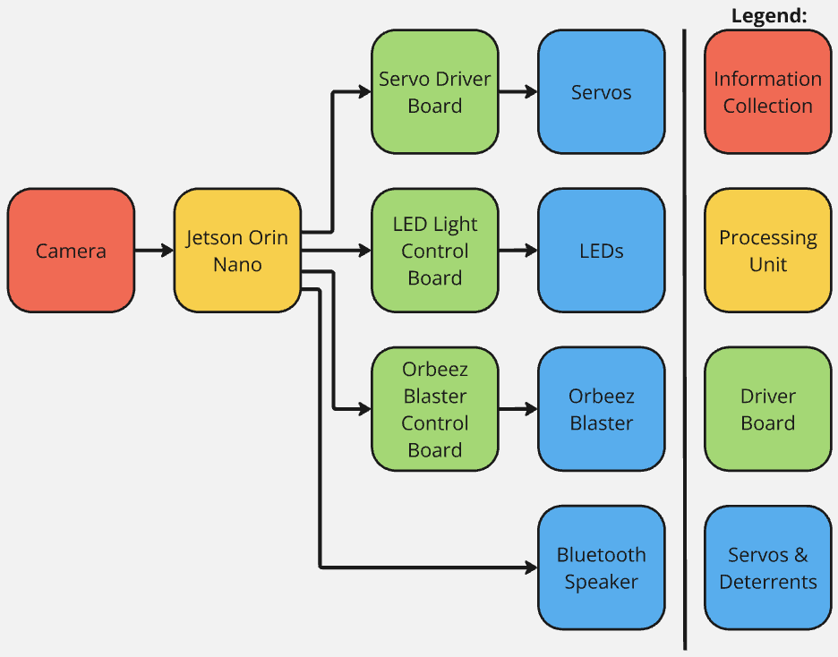
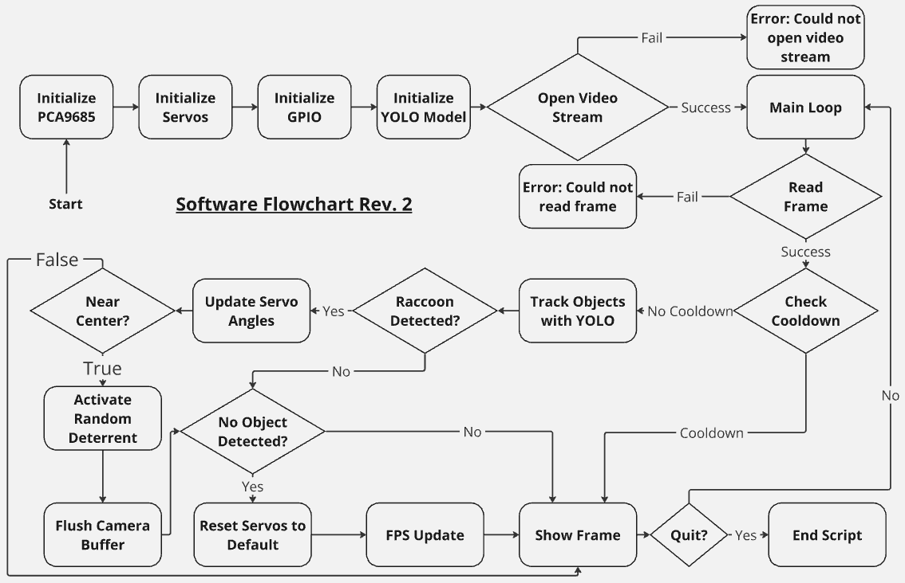

# 🎯 Automated Computer Vision Deterrent System

An intelligent, real-time object detection and tracking system that automatically aims and activates deterrent mechanisms against detected targets. Built for ECE-3332 Microcontroller Project Lab.



## 🚀 Features

- **Real-time Object Detection**: Custom-trained YOLOv8 models for raccoon and human detection
- **Automated Aiming**: 3-servo pan-tilt system with proportional control
- **Multi-Deterrent System**: Strobe light, Orbez gun, and audio alerts
- **Dual Platform Support**: NVIDIA Jetson Orin Nano and Raspberry Pi 4B
- **Safety Systems**: Angle limits, cooldown periods, and error handling
- **Custom Hardware**: 3D-printed components and custom circuit designs

## 🎥 Demo Videos

*[Add your demo videos here]*

## 🛠️ Hardware Components

### Core Platform
- **NVIDIA Jetson Orin Nano** (Primary)
- **Raspberry Pi 4B** (Alternative)
- **USB Camera** (1080x720 resolution)
- **PCA9685 PWM Controller** (Servo control)

### Servo System
- **Pan Servo**: Horizontal movement
- **Tilt Servo**: Vertical movement  
- **Tilt Servo (Opposite)**: Counter-balancing

### Deterrent Mechanisms
- **Strobe Light**: GPIO-controlled flashing
- **Orbez Gun**: Automated projectile launcher
- **Speaker**: Audio deterrent system

### Custom 3D Printed Parts
- Servo holders and platforms
- Aiming platform connectors
- Speaker mounts
- Ammo rack system

## 📁 Project Structure

```
ECE-3332-Microcontroller-Project-Lab/
├── Final_ProjectBuild/           # Production-ready code
│   ├── pytorch_usbcam_aiming_3servo_deterrent.py
│   ├── 1_RACCOON_pytorch_usbcam_aiming_3servo_deterrent.py
│   ├── 2_HUMAN_pytorch_usbcam_aiming_3servo_deterrent_2_.py
│   ├── Models/                   # Trained YOLOv8 models
│   └── Flowcharts/               # System diagrams
├── ProjectBuild/                 # Development code
│   ├── MainTrackingCode.py       # CSRT tracker implementation
│   ├── TF_Lite_Model/           # TensorFlow Lite training
│   └── Platform-specific code
├── Hardware/                     # Physical components
│   ├── 3D_Models/              # Custom parts
│   └── Hardware_Schematics/    # Circuit diagrams
└── Instructionals/             # Learning materials
    ├── Learn_OpenCV/           # Computer vision basics
    ├── Learn_TensorFlow/       # ML fundamentals
    ├── ObjectTracking/         # Tracking algorithms
    └── Platform Setup/         # Installation guides
```

## 🚀 Quick Start

### Prerequisites
- NVIDIA Jetson Orin Nano or Raspberry Pi 4B
- Python 3.8+
- OpenCV
- PyTorch/YOLOv8
- Hardware components (servos, camera, etc.)

### Installation

1. **Clone the repository**
   ```bash
   git clone https://github.com/yourusername/ECE-3332-Microcontroller-Project-Lab.git
   cd ECE-3332-Microcontroller-Project-Lab
   ```

2. **Set up the environment**
   ```bash
   # For Jetson Orin Nano
   pip install ultralytics opencv-python pygame
   pip install adafruit-circuitpython-pca9685 adafruit-circuitpython-motor
   
   # For Raspberry Pi 4B
   sudo apt install python3-venv
   python3 -m venv --system-site-packages env
   source env/bin/activate
   pip install opencv-contrib-python ultralytics
   ```

3. **Hardware Setup**
   - Connect PCA9685 to I2C pins
   - Attach servos to channels 0, 1, 2
   - Connect strobe light to GPIO pin 7
   - Connect Orbez gun trigger to GPIO pin 33
   - Mount USB camera

4. **Run the system**
   ```bash
   # For general object detection
   python Final_ProjectBuild/pytorch_usbcam_aiming_3servo_deterrent.py
   
   # For raccoon-specific detection
   python Final_ProjectBuild/1_RACCOON_pytorch_usbcam_aiming_3servo_deterrent.py
   
   # For human-specific detection
   python Final_ProjectBuild/2_HUMAN_pytorch_usbcam_aiming_3servo_deterrent_2_.py
   ```

## 🎯 Usage

### Controls
- **'q'**: Quit the application
- **'r'**: Pause/resume tracking (in some versions)

### System Behavior
1. **Detection**: Continuously scans for target objects
2. **Tracking**: Calculates object center coordinates
3. **Aiming**: Adjusts servo angles to center the target
4. **Activation**: Triggers deterrent when target is centered
5. **Cooldown**: Waits before next activation cycle

### Configuration
Key parameters can be adjusted in the code:
- `strobe_duration`: Strobe light duration (seconds)
- `num_shots`: Number of Orbez gun shots
- `cooldown_period`: Delay between activations
- `max_step_size`: Servo movement speed
- `tilt_min_angle`/`tilt_max_angle`: Safety limits

## 🧠 Machine Learning Models

### Custom Trained Models
- **best100.pt**: Main raccoon detection model
- **best10.pt**: Lightweight raccoon model
- **best100_yolov8s.pt**: YOLOv8s variant
- **yolov8n.pt**: Standard YOLOv8 nano for humans

### Training Data
- **Raccoon Dataset**: 302 training images, 81 validation images
- **Format**: Pascal VOC XML annotations
- **Augmentation**: Roboflow integration for data enhancement

## 🔧 Technical Specifications

### Performance
- **Detection Speed**: Real-time processing
- **Accuracy**: Custom models achieve high precision on target classes
- **Latency**: <100ms servo response time
- **FPS**: 15-30 FPS depending on model complexity

### Safety Features
- **Angle Limits**: Prevents servo damage
- **Error Handling**: Graceful failure recovery
- **Cooldown System**: Prevents rapid-fire activation
- **Buffer Management**: Camera buffer flushing

## 📊 System Architecture



### Detection Pipeline
1. **Video Capture**: USB camera input
2. **Object Detection**: YOLOv8 inference
3. **Tracking**: Center coordinate calculation
4. **Servo Control**: Proportional angle adjustment
5. **Deterrent Activation**: Random selection mechanism

### Hardware Interface
- **I2C Communication**: PCA9685 servo control
- **GPIO Control**: Strobe light and gun trigger
- **PWM Signals**: Servo positioning
- **Audio Output**: Speaker system

## 🎓 Learning Outcomes

This project demonstrates proficiency in:
- **Computer Vision**: OpenCV, object detection, tracking
- **Machine Learning**: Model training, YOLO implementation
- **Embedded Systems**: GPIO control, PWM, I2C communication
- **Real-time Systems**: Performance optimization, safety systems
- **Hardware Integration**: 3D printing, circuit design, mechanical assembly

## 📚 Educational Resources

The `Instructionals/` directory contains comprehensive learning materials:
- **OpenCV Basics**: Image processing fundamentals
- **Object Detection Theory**: YOLO algorithm explanation
- **Tracking Algorithms**: CSRT, KCF, and other methods
- **Platform Setup**: Detailed installation guides
- **Hardware Schematics**: Circuit design documentation

## 🤝 Contributing

This is an academic project, but suggestions and improvements are welcome:
1. Fork the repository
2. Create a feature branch
3. Make your changes
4. Submit a pull request

## 📄 License

This project is for educational purposes. Please respect academic integrity guidelines.

## 👨‍💻 Author

**Your Name**  
ECE-3332 Microcontroller Project Lab  
[Your University]

## 🙏 Acknowledgments

- **Ultralytics**: YOLOv8 implementation
- **OpenCV**: Computer vision library
- **Adafruit**: Hardware control libraries
- **Roboflow**: Dataset management and augmentation
- **Instructors**: ECE-3332 course guidance

---

⭐ **Star this repository if you found it helpful!**

## 📞 Contact

For questions or collaboration opportunities:
- **Email**: [your.email@university.edu]
- **LinkedIn**: [Your LinkedIn Profile]
- **GitHub**: [Your GitHub Profile]

---

*Built with ❤️ for ECE-3332 Microcontroller Project Lab*
